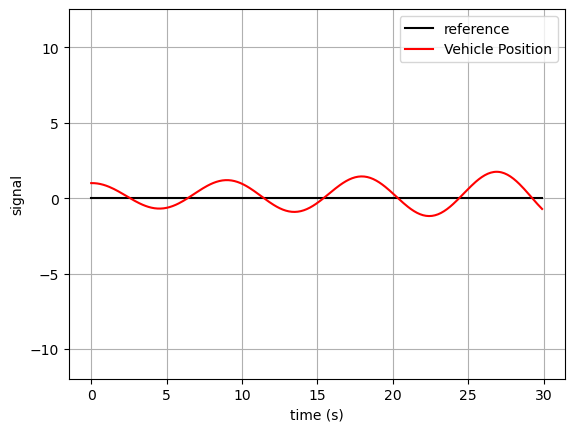
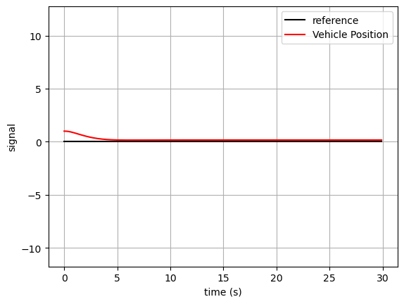
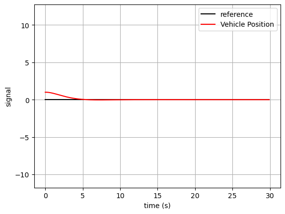

# PID 제어
---
## P제어
1.코드


```python
import import_ipynb
from vehicle_model import VehicleModel
import numpy as np
import matplotlib.pyplot as plt

class P_Controller(object):
    u = 0
    e = 0
    p_gain = 0
    def __init__(self, P_Gain=0.5):
        self.p_gain = P_Gain
        # Code
        
    def ControllerInput(self, reference, measure):
        self.e = reference-measure
        self.u = self.p_gain*self.e
        # Code


if __name__ == "__main__":
    target_y = 0.0 #reference y = 0
    measure_y =[] 
    time = []
    step_time = 0.1
    simulation_time = 30 #경계값
    plant = VehicleModel(step_time, 0.0, 0.99, 0.1) #plant init
    controller = P_Controller() #생성자
    
    for i in range(int(simulation_time/step_time)):
        time.append(step_time*i)
        measure_y.append(plant.y_measure[0][0]) #plant...
        controller.ControllerInput(target_y, plant.y_measure[0][0])
        plant.ControlInput(controller.u)
    
    plt.figure()
    plt.plot([0, time[-1]], [target_y, target_y], 'k-', label="reference")
    plt.plot(time, measure_y,'r-',label = "Vehicle Position")
    plt.xlabel('time (s)')
    plt.ylabel('signal')
    plt.legend(loc="best")
    plt.axis("equal")
    plt.grid(True)
    plt.show()
```

    importing Jupyter notebook from vehicle_model.ipynb


    

    


2.특징  
- reference 값 주변에에서 oscillation 발생

---
## PD 제어기  
1.코드


```python
import import_ipynb
from vehicle_model import VehicleModel
import numpy as np
import matplotlib.pyplot as plt

class PD_Controller(object):
    u = 0
    e = 0
    p = 0
    d = 0
    t = 0
    pre_e =0
    def __init__(self, reference, measure, step_time, P_Gain=0.6, D_Gain=1.2):
        self.t = step_time
        self.p  = P_Gain
        self.d = D_Gain
        self.pre_e =reference-measure
    
    def ControllerInput(self, reference, measure):
        self.e = reference - measure
        ee = self.e - self.pre_e
        self.pre_e = self.e
        self.u = self.p*self.e + self.d*(ee/self.t)
        


if __name__ == "__main__":
    target_y = 0.0
    measure_y =[]
    time = []
    step_time = 0.1
    simulation_time = 30   
    plant = VehicleModel(step_time, 0.0, 0.99, 0.1)
    controller = PD_Controller(target_y, plant.y_measure[0][0], step_time)
    
    for i in range(int(simulation_time/step_time)):
        time.append(step_time*i)
        measure_y.append(plant.y_measure[0][0])
        controller.ControllerInput(target_y, plant.y_measure[0][0])
        plant.ControlInput(controller.u)
    
    plt.figure()
    plt.plot([0, time[-1]], [target_y, target_y], 'k-', label="reference")
    plt.plot(time, measure_y,'r-',label = "Vehicle Position")
    plt.xlabel('time (s)')
    plt.ylabel('signal')
    plt.legend(loc="best")
    plt.axis("equal")
    plt.grid(True)
    plt.show()

```


    

    


2.한계
- steady state error 존재


---
## PID 제어기  
1.코드


```python
from vehicle_model import VehicleModel
import numpy as np
import matplotlib.pyplot as plt

class PID_Controller(object):
    u = 0 
    e = 0
    p = 0
    d = 0
    i = 0
    t = 0
    _sum = 0
    pre_e = 0
    def __init__(self, reference, measure, step_time, P_Gain=0.4, D_Gain=0.9, I_Gain = 0.02):
        self.t = step_time
        self.p  = P_Gain
        self.d = D_Gain
        self.i = I_Gain
        self.pre_e =reference-measure   
    
    def ControllerInput(self, reference, measure):
        self.e = reference - measure
        ee = self.e - self.pre_e
        self.pre_e = self.e
        self._sum += self.e*self.t
        self.u = self.p*self.e + self.d*(ee/self.t) + self.i*self._sum  
        # Code
        
        
if __name__ == "__main__":
    target_y = 0.0
    measure_y =[]
    time = []
    step_time = 0.1
    simulation_time = 30   
    plant = VehicleModel(step_time, 0.0, 0.99, 0.05)
    controller = PID_Controller(target_y, plant.y_measure[0][0], step_time)
    
    for i in range(int(simulation_time/step_time)):
        time.append(step_time*i)
        measure_y.append(plant.y_measure[0][0])
        controller.ControllerInput(target_y, plant.y_measure[0][0])
        plant.ControlInput(controller.u)
    
    plt.figure()
    plt.plot([0, time[-1]], [target_y, target_y], 'k-', label="reference")
    plt.plot(time, measure_y,'r-',label = "Vehicle Position")
    plt.xlabel('time (s)')
    plt.ylabel('signal')
    plt.legend(loc="best")
    plt.axis("equal")
    plt.grid(True)
    plt.show()

```


    

    


2.한계
- steady state error 존재


- steady state error 해결  
- 처음 reference 도달할 때 overshoot 발생


```python

```
